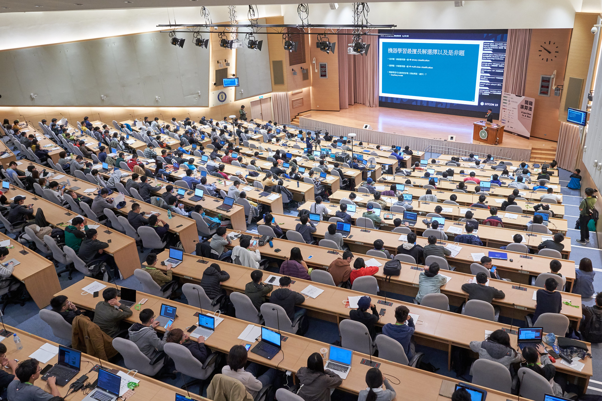

title: SITCON 2020
output: index.html

--

<h1 style="font-size: 72px">
  SITCON 2020 
  學生計算機年會
</h1>
 

## SITCON 共同發起人
## Denny Huang

--

### Who am I ?

 
<h2 style="font-size: 60px">
  <b>Denny Huang</b>
</h2>

* SITCON 2013, 2014 總召

* Rayark Inc.

* <a href="http://about.me/denny0223" target="_blank">About me</a>

--

  
  <h2>Students’ Information Technology Conference</h2>
  <a href="http://sitcon.org/">https://sitcon.org</a>

--

# 給學生一個發表的舞台。

--

# 研討會
## Since 2013
## 200 人 -> 1200 人

--

  

--

  

--

# 讓一群熱愛資訊的人有交流的機會。

--

# SITCON 2020
## 2020 / 03 / 28
## 中央研究院 人文社會科學館

--

  

--

  

--

### 投稿議程
- Presentation

- Espresso

--

### Call for Paper

   
  https://sitcon.org/2020/cfp/

--

### 遠道而來票

   
  https://bit.ly/sitcon2020-traveler

--

### 特別貢獻票

   
  http://bit.ly/sitcon2020-contributor

--

### 個人贊助

   
  https://bit.ly/donatesitcon2020

--

### 企業贊助
<h1 style="font-size:72px">contact@sitcon.org</h1>

--

<h1 style="font-size:72px">Thanks for listening</h1>
